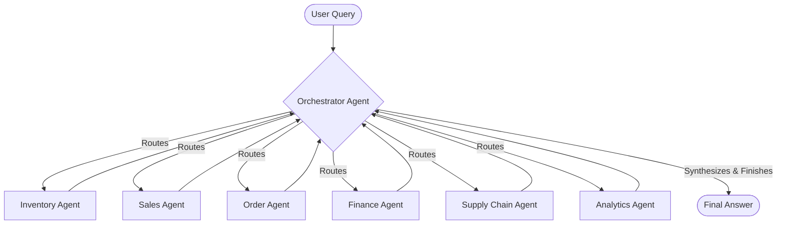

# Retail AI Multi-Agent System Architecture

This document provides a comprehensive overview of the architecture for the Retail Multi-Agent AI Platform. The platform uses a **Hierarchical Supervisor Architecture** built on top of [LangGraph](https://langchain-ai.github.io/langgraph/) to orchestrate multiple specialized LLM agents. 

By decentralizing tasks into specialized domains, the system can execute complex, cross-functional retail queries (e.g., comparing sales figures with inventory levels and vendor lead times) securely and reliably.

---

## 🏗️ High-Level Architecture

The platform consists of three core layers:

1. **User Interface / Web Layer**: A premium **React/Vite** frontend providing a rich, dynamic chat interface.
2. **API & Orchestration Layer**: A **FastAPI** backend that hosts the intelligent core consisting of the **Supervisor (Orchestrator)** and several **Domain Specialist Agents**. This layer relies on OpenAI (`gpt-4o`) or Anthropic (`claude-3-5-sonnet`) models managed via LangGraph.
3. **Integration & Persistence Layer**: A suite of specialized tools that connect to a real-time **Supabase PostgreSQL database**. This acts as both the centralized data store for retail data and the persistent state memory store for agent conversations.

---

## 🤖 The Multi-Agent Graph

The system employs a **Supervisor-Worker pattern**. Instead of one monolithic agent trying to do everything, the Supervisor delegates tasks to domain experts.

### How a Request is Processed
1. **User Request**: The user asks, *"Compare sales vs inventory levels for the top 50 products."*
2. **Supervisor Planning**: The Orchestrator receives the prompt. It decides it first needs sales data. It routes execution to the **Sales Agent**.
3. **Worker Execution (Sales)**: The Sales Agent uses its `get_sales_volume` tool, retrieves the data, and returns its response back to the Orchestrator.
4. **Supervisor Re-evaluation**: The Orchestrator evaluates the current state. It now has sales data but needs inventory data. It routes execution to the **Inventory Agent**.
5. **Worker Execution (Inventory)**: The Inventory Agent uses its `get_stock_by_location` tool, retrieves the data, and returns it to the Orchestrator.
6. **Synthesis**: The Orchestrator now has all required data. It routes to the **Analytics Agent** to compare the datasets, or it synthesizes the final response itself and ends the execution (`FINISH`).

---

## 🏢 Domain Specialist Agents

Each specialist is a [ReAct Agent](https://react-lm.github.io/) equipped with a strict system prompt and a specific set of tools. The tools dynamically query the **Supabase Database** to retrieve real-time retail data.

| Agent | Responsibility | Tools Provided |
|-------|----------------|----------------|
| **Orchestrator** | Task planning, agent coordination, routing, and final synthesis. | *None (Routes to others)* |
| **Inventory Agent** | Tracks stock levels, product movement, and WMS integrations. | `get_stock_by_location`, `forecast_stock_depletion` |
| **Sales Agent** | Analyzes revenue, historical trends, and POS data. | `get_sales_volume`, `calculate_yoy_growth` |
| **Order Agent** | Manages fulfillment status, shipping delays, and OMS tracking. | `find_delayed_orders`, `get_order_status` |
| **Finance Agent** | Handles ERP metrics, P&L generation, and profit margin analysis. | `generate_pnl_summary`, `calculate_product_margin` |
| **Supply Chain Agent**| Manages vendor relationships, lead times, and replenishment. | `get_vendor_lead_times`, `generate_replenishment_order` |
| **Analytics Agent** | Executes complex data synthesis, reasoning, and root-cause analysis. | *None (Acts as an advanced reasoning engine)* |

---

## 🔒 State Management

LangGraph maintains the **AgentState** object which is passed between agents. Our state definition (`core/state.py`) keeps a running log of all `messages`. 

- When a specialist agent is invoked, it sees the entire conversation history.
- When it replies, its response is appended to the `messages` array.
- The Orchestrator reads the latest messages to determine the next node to transition to.

### Persistent Memory (PostgreSQL Checkpointing)
The system utilizes the official `langgraph-checkpoint-postgres` library to save the conversation state securely in the Supabase PostgreSQL database. 
- The React frontend generates a unique `session_id`.
- The FastAPI backend uses this `session_id` as the LangGraph `thread_id`.
- The `PostgresSaver` checkpointer reads/writes the state to `checkpoints`, `checkpoint_blobs`, and `checkpoint_writes` tables, ensuring conversations survive server restarts and browser refreshes.
